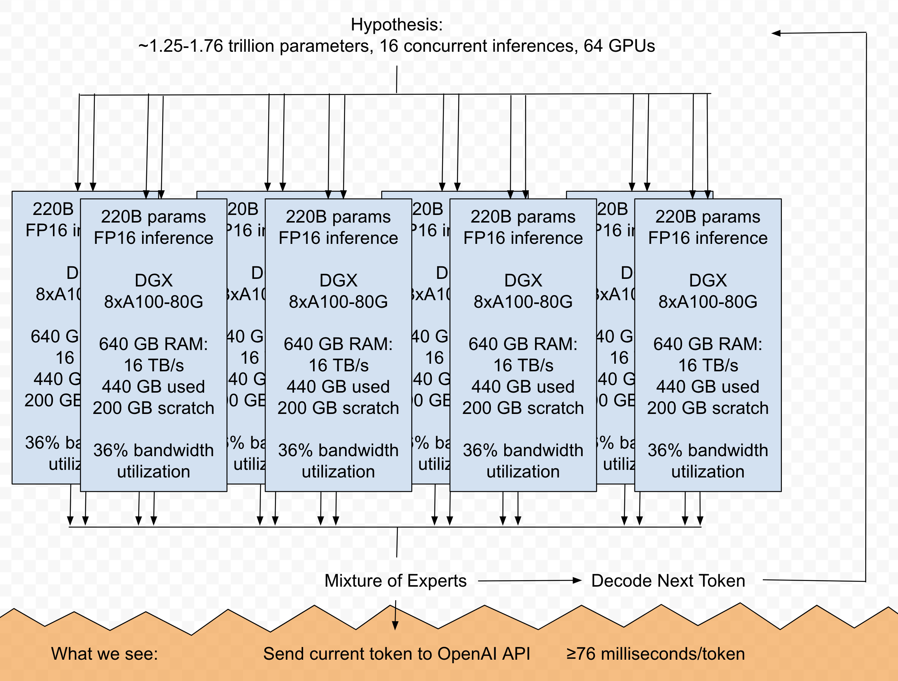

# GPT-4 Benchmarks

Reverse-engineering the GPT-4 language model through simulation.

## What we know so far

Unconfirmed statement that GPT-4 is "8 x 220 B with 16 inferences". What those words mean is not completely understood. You would expect 8 separate models = 8 separate inferences, but instead it is 16. Why?

Empirical data:
- 13.1 tokens/second peak on the OpenAI API, with 6-12 tokens/second on average
- Another independent source measured 8-9 tokens/second

TODO:

Swift Colab notebook that inputs data about max bandwidth achieved on A100 for FP16 and Int8 matrix multiplication, inputs latency of FlashAttention for different sequence sizes.

Timeframe: will have to work on the notebook in spare time, might take a few days to finish.

## Motivation

This is out of academic curiosity. I have been interested in GPT-4 for a while, ever since the launch video said it could write code very well. Unfortunately OpenAI wasn't open and didn't release a paper explaining its architecture. This repo is hopefully a remedy for that. My goal is to reach better accuracy than [lucidrains/alphafold2](https://github.com/lucidrains/alphafold2) at predicting AlphaFold 2.
